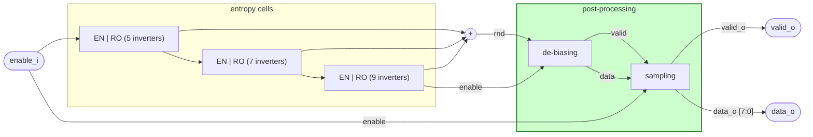

```mermaid
flowchart LR
    %% Entropy cells
    enable_i([enable_i])

    subgraph entropy_cells["entropy cells"]
        RO5["EN | RO (5 inverters)"]
        RO7["EN | RO (7 inverters)"]
        RO9["EN | RO (9 inverters)"]
    end

    %% Enable chain
    enable_i --> RO5
    RO5 --> RO7
    RO7 --> RO9

    %% Combine outputs
    RO5 --> SUM((+))
    RO7 --> SUM
    RO9 --> SUM

    %% Processing block
    subgraph processing["post-processing"]
        DEBIAS["de-biasing"]
        SAMPLING["sampling"]
    end

    %% Highlight subgraph
    style processing fill:#ccffcc,stroke:#2e7d32,stroke-width:2px

    %% Random output
    SUM -->|rnd| DEBIAS

    %% Enable feedback from last cell
    RO9 -->|enable| DEBIAS

    %% Sampling connections
    DEBIAS -->|valid| SAMPLING
    DEBIAS -->|data| SAMPLING
    enable_i -->|enable| SAMPLING

    %% Outputs
    SAMPLING -->|valid_o| valid_o([valid_o])
    SAMPLING -->|"data_o [7:0]"| data_o([data_o])
```
